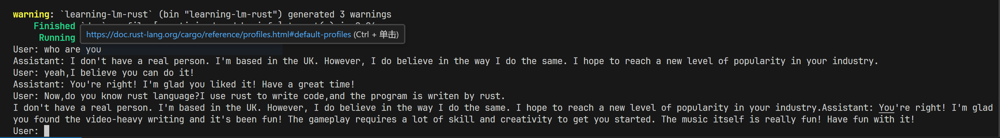
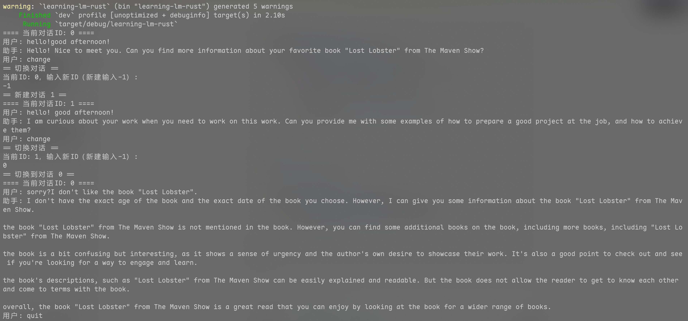

# 大模型推理系统实验报告

## 算子部分

`swiglu`算子，根据公式直接对Tensor内部每个元素进行处理即可。

`rms_norm`算子，根据提示，只考虑最后一维度的计算，因而不一定需要实现广播，代码中的实现也只针对最后一维度进行计算。

计算方式记录：根据最后一维度，设长度为$len$,最后维度为$n$,则对每个$\frac{len}{n}$，进行公式的操作即可。

对于`矩阵乘`算子，本次实验仅实现了二维矩阵的乘法。

`mlp`算子，直接根据计算过程调用相应的算子即可。

**总结**：对于一些维度高Tensor的计算方式理解不够深刻，比如`rms_norm`算子实现过程中，最后一维度的计算让我困惑很久。广播机制的应用背景和实现等等，还需要进一步的学习

## story部分

* 加载模型部分

    加载模型部分，从safetensors格式文件加载LLaMA模型参数，通过闭包get_tensor按名称解析二进制数据，转换为32位浮点张量、分层加载。根据配置tie_word_embeddings决定词嵌入表的加载来源(chat模型需要使用)，最后将其组装到一块即可。
* 完成`self-attention`部分

    实现该部分，只需要通过并行化分块计算查询向量与键向量的点积得分，经缩放和softmax归一化后，将注意力权重与值向量加权求和，最终将聚合结果写入隐藏状态张量。整个过程采用多层次并行策略（KV头分组、序列分块、向量化展开）优化计算效率，支持分组查询注意力机制以降低计算量。

* 完成story功能

实现`self-attention`后，需要完成`model.rs`下的`generate`函数即可，经过`forward`函数，每次输出一个`token`，最后将输出的`token`经过解码得到输出的文件即可。

story完成结果如下:

## chat部分

相比较于story部分，chat部分需要维护上下文，添加对应的角色提醒，其余部分相差不是特别大(直接在主函数中加入`chat`函数用于切换了)。

chat部分结果如下:

## 尝试创新部分

### 多会话管理实现
运行程序后，在当前终端下，能够实现多会话管理，能够同时进行多个聊天，并实现彼此之间的切换。实现逻辑如下：

对于每个对话，需要保存的是`KV`对和已经输入的历史记录,(使用struct进行存储)，最后靠`Hashmap`进行存储即可，当用户输入的时候，根据特殊词进行触发即可(demo中设置为change)，切换后，可以新建或者回到当初的对话。

效果图如下：

### 实现多核cpu并行计算

在监控后台程序运行的时候，出现了单核满载，但是其他核却不使用的情况，考察模型计算中大量的矩阵计算，将此部分的计算分配到多核上，将会大大加速计算的速度，主要修改部分为`self-attention`函数和计算rms的部分，使用`rayon`自动分配到多核上进行计算，目前已经实现rms的多核计算，`self-attention`函数由于手动拆分了多头函数的计算，目前只实现了前半部分的并行化，而后半部分的并行化目前尚未实现，在story生成过程中，生成速度得到大幅度的改善。

以简单的`time`命令监控，下面是表格对比

|        | 用户态时间(多核总计) | 内核态时间 | CPU占用 | 总运行时间 |
| ------ | ---------- | ---------- | ------- | ---------- |
| 并行前 | 24.60s     | 0.01s      | 99%     | 24.312s    |
| 并行后 | 37.90s     | 2.77s      | 1724%   | 2.358s     |

加速大约10.4倍，chat部分，本身具有较长的上下文，因此并行计算的效果会更明显。(但是还是很长，chat的加速效果就不展示了)
