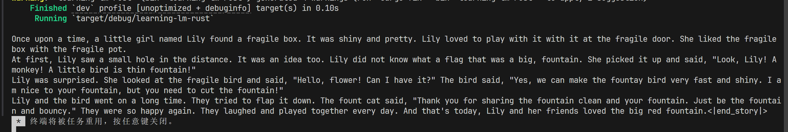

# 大模型推理系统实验报告

## 算子部分

`swiglu`算子，根据公式直接对Tensor内部每个元素进行处理即可。

`rms_norm`算子，根据提示，只考虑最后一维度的计算，因而不一定需要实现广播，代码中的实现也只针对最后一维度进行计算。

计算方式记录：根据最后一维度，设长度为$len$,最后维度为$n$,则对每个$\frac{len}{n}$，进行公式的操作即可。

对于`矩阵乘`算子，本次实验仅实现了二维矩阵的乘法，在转置部分，为方便编写代码，使用了额外的内存(可优化部分)，进行计算。

`mlp`算子，直接根据计算过程调用相应的算子即可。

**总结**：对于一些维度高Tensor的计算方式理解不够深刻，比如`rms_norm`算子实现过程中，最后一维度的计算让我困惑很久。广播机制的应用背景和实现等等，还需要进一步的学习

## story部分

* 加载模型部分

* 完成`self-attention`部分

* 完成story功能

补全上述功能后，需要完成`model.rs`下的`generate`函数即可，经过`forward`函数，每次输出一个`token`，最后将输出的`token`经过解码得到输出的文件即可。

story完成结果如下:

## chat部分